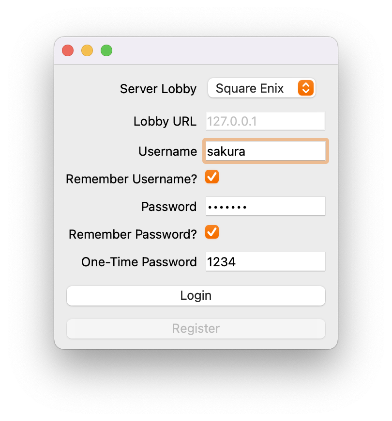

# Astra

A FFXIV launcher for Linux that supports profiles, multiple accounts and [Dalamud](https://github.com/goatcorp/Dalamud) plugins!

### Notice

Astra is _beta software_. Despite this, the launcher is feature complete, but you may find it lacking for the use-cases
below:

* [Logging into Steam-linked accounts is unsupported.](https://todo.sr.ht/~redstrate/astra/1)

If you still have questions, please read the [FAQ](https://xiv.zone/astra/faq) first.

## Features

* Handles running Wine for you, creating a seamless and native-feeling launcher experience!
    * Can also easily enable several Linux-specific enhancements such as Fsync or configuring Gamescope.
* Multiple account support!
    * Can associate a Lodestone character with an account to use as an avatar.
* Easily install and use Dalamud plugins.
* Game patching support.
* Securely login to the official Square Enix lobbies, as well as Sapphire servers.
    * Game arguments are encrypted by default, providing the same level of security as other launchers.
    * Saving account usernames and passwords are also supported, and is never stored plaintext.
* Can install FFXIV on new systems for you, bypassing the normal InstallShield installer.

## Get It

Details on where to find stable releases of Astra can be found on its [homepage](https://xiv.zone/astra).

Distribution packaging is encouraged, so please send an [email through the mailing list](https://lists.sr.ht/~redstrate/public-inbox) for any concerns.

## Support

If you have an issue with Astra, please [send an email to the mailing list](https://lists.sr.ht/~redstrate/public-inbox).

## Building

Please refer to the [building document](BUILDING.md) for instructions on how to build Astra.

## Contributing

Please refer to the [contributing document](CONTRIBUTING.md) for everything you need to know to get started contributing to Novus.

## License

This project is licensed under the [GNU General Public License 3](LICENSE). Some code or assets may be licensed differently, please refer to the [REUSE](https://reuse.software/spec/) metadata.